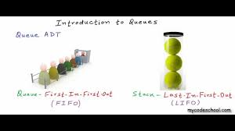

Page under Construction !

### This page is about LIFO

# Practical Applications of LIFO

LIFO is an acronym for Last In, First Out.

This is a method of data organization, where the last element added to the stack is the first one removed.

The LIFO concept does not directly apply to maps, linked lists, and trees however LIFO can be
associated with these data structures in the context of specific applications or operations
Starting with maps or associative arrays, which are collections of key value pairs. They do not
inherently follow a LIFO principle as they are designed for fast retrieval, insertion, and deletion
based on keys. However, you can use stacks to track the insertion order in maps if needed for
specific applications, such as undo functionality in a key value store where the most recently
added entry needs to be removed first. Linked lists themselves are not LIFO structures, you can
implement a stack using a linked list by adding and removing elements from the same end of the
list, effectively utilizing the LIFO principle in the context of linked list operations. Trees do not
intrinsically operated on a LIFO principle, but tree traversal algorithms, such as depth first search
(DFS) can utilize a stack and the LIFO principle to explore the depth of the tree first, moving
through one branch to its leaves before backtracking to explore other branches.

[Back to Overview](https://github.com/lachisholm/Data_Structure_Discovery/blob/main/Overview.md)

