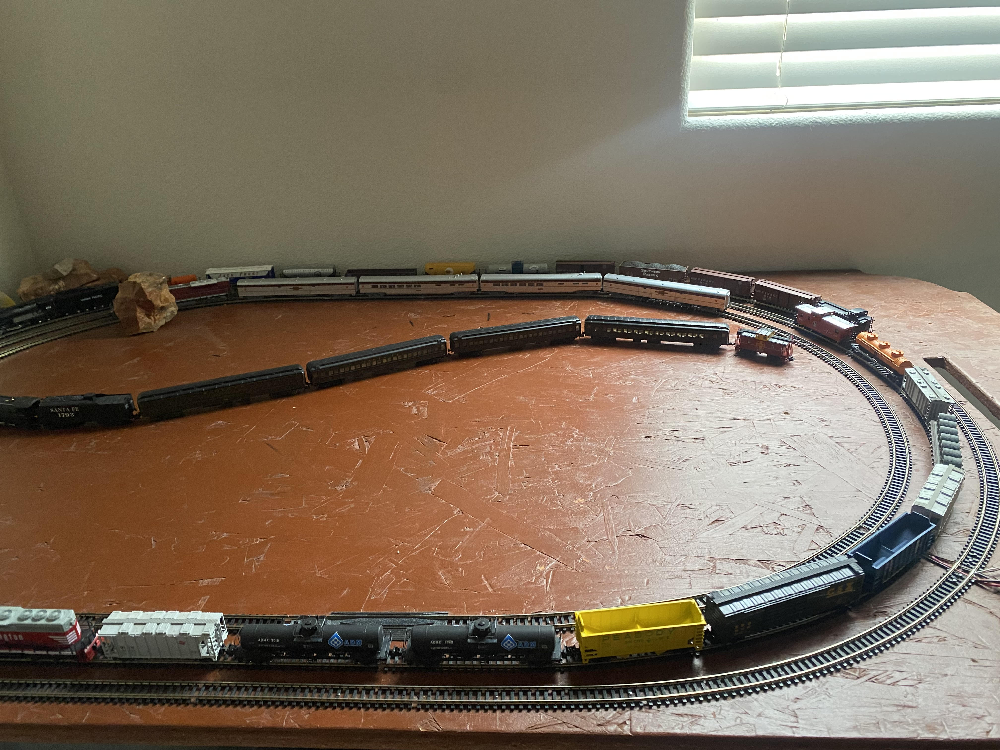

# Linked Lists


### What is a Linked List?

Linked lists are a linear data structure consisting of elements (nodes) that are linked
together using pointers or references.

A linked list is a linear data structure that stores data elements in nodes connected by pointers. The first node in a linked list is called the head node, and the last node is called the tail node. Each node has two parts:

1. The part that stores the element, the actual value or data that needs to be stored.
2. The part that stores the link to the next node in the list, creating a link between the nodes.

---

## How to define a list in Python

```python
class LinkedList:
    def __init__(self):
        self.head = None
```

The `LinkedList` class shown above initializes a linked list with a `head` property, which points to the first node in the list. This initialization is crucial as it lays the foundation for a sequence of nodes, where each node is linked to the next, forming the list.

### Dynamic Memory Management

Unlike arrays, linked lists are not constrained by the need for contiguous memory allocation. This allows for dynamic memory usage, enabling efficient management of data. As a result, linked lists are particularly suited for:

- Applications requiring frequent insertions and deletions.
- Implementing data structures like stacks and queues.
- Managing dynamic datasets where the size can fluctuate.

### Flexibility and Variety

**Linked lists provide unparalleled flexibility** in data management, not requiring continuous memory space. Each node in a linked list encapsulates a value and a pointer to the next node, allowing the structure to expand or contract as needed dynamically.

There are several types of linked lists, each offering unique advantages:

- **Singly Linked Lists:** Each node points to the next node, with the last node pointing to `None`.
- **Doubly Linked Lists:** Nodes point both to the next and the previous node, facilitating backward navigation.
- **Circular Linked Lists:** The list forms a circle where the last node points back to the first node, allowing for circular traversal.


Steps for creating a linked list

1. Create a node

```Python
class Node:
    def __init__(self, data):
        self.data = data
        self.next = None
```

2. Connect nodes

```Python
class Node:
    def __init__(self, data):
        self.data = data
        self.next = None

class LinkedList:
    def __init__(self):
        self.head = None

```

3. Append nodes

```Python
def append(self, data):
    new_node = Node(data)
    if self.head is None:
        self.head = new_node
        return
    last = self.head
    while last.next:
        last = last.next
    last.next = new_node
```

4. Insert nodes

```Python
def insert(self, prev_node, data):
    if not prev_node:
        print("Previous node must inLinkedList.")
        return
    new_node = Node(data)
    new_node.next = prev_node.next
    prev_node.next = new_node
```

5. Delete nodes by Value

```Python

class Node:
    def __init__(self, data):
        self.data = data
        self.next = None

class LinkedList:
    def __init__(self):
        self.head = None

    def delete_node_by_value(self, key):
        temp = self.head

        # If the list is empty
        if temp is None:
            return

        # If the node to be deleted is the head node
        if temp is not None and temp.data == key:
            self.head = temp.next
            temp = None
            return

        # Search for the node to be deleted
        while temp is not None:
            if temp.data == key:
                break
            prev = temp
            temp = temp.next

        # If the key was not present
        if temp == None:
            print("The value was not found in the list.")
            return

        # Unlink the node from the list
        prev.next = temp.next
        temp = None

```

Deleting a node by its position in the list requires a different approach

6. Delete a node by Position

```Python

    def delete_node_by_position(self, position):
        if self.head is None:
            return

        temp = self.head

        # If head needs to be removed
        if position == 0:
            self.head = temp.next
            temp = None
            return

        # Find the previous node of the node to be deleted
        for i in range(position - 1):
            temp = temp.next
            if temp is None:
                break

        # If position is more than the number of nodes
        if temp is None or temp.next is None:
            print("The position is beyond the list length.")
            return

        # Node temp.next is the node to be deleted
        # Store pointer to the next of node to be deleted
        next = temp.next.next

        # Unlink the node from the list
        temp.next = None
        temp.next = next
```

## Using a Linked List in Python

```Python
# Creating a linked list and populating it with nodes
linked_list = LinkedList()
linked_list.append(1)
linked_list.append(2)
linked_list.append(3)

# Inserting a node after the head
linked_list.insert(linked_list.head, 1.5)

# Deleting a node
linked_list.delete_node(2)
```

"A common example of a linked list is a train, all cars are connected together singly. To compare this with computer applications, the undo functionality of an application can be a linked list and the redo would be another linked list going only in one direction to the last operation." Study.com


Adding or deleting from lists is pretty simple, quick and easy to do, while it takes just a single step. If your looking for a specific item in the list it probably will take a bit longer because you have to go through the list checking each link until you find what your looking for.

Linked Lists can also be used in creating or building out stacks and queues as well.

> **_ Stacks - While there are many different examples to what you can relate stacks to, the easiest is a stack of plates, where you can only add or remove items from the top of the stack. _**
>
> **_ Queues - like a line, you add items to the back and remove them from the front._**

---

## Challenge: Reverse a Linked List

**Task:** Implement a reverse method in the LinkedList class. This method should reverse the order of nodes in the list so that the last node becomes the first.

**Requirements:**

- Do not use any additional data structures.
- Modify the list in place.

[Back to Overview](https://github.com/lachisholm/Data_Structure_Discovery/blob/main/Overview.md)
