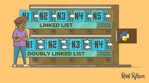

# Data_Structure_Discovery

Exploration of (LIFO) stacks, linked lists and trees presentation
BYU Idaho Winter 2024

# Understanding Fundamental Data Structures

## I. Introduction

### A. Overview

As part of this discussion I will cover the fundamental data structures. These structures are concepts that are the basics of data structures in the computer science field. I found that many of these structures are easy to learn with reading the right sources and information that is found over the internet and throughout Data Science books.Here is a list of the concepts that I will cover in this reading.

<ul>
    <li>[Overview for this project]
        (https://github.com/lachisholm/Data_Structure_Discovery/blob/main/Overview.md).
<ul>

<ul>
    <li> * [Map - also known as Dictionaries](https://github.com/lachisholm/Data_Structure_Discovery/blob/main/Maps.md).

<ul>

<ul>
    <li> * [Linked lists](https://github.com/lachisholm/Data_Structure_Discovery/blob/main/Links.md).
<ul>

<ul>
    <li> * [Trees](https://github.com/lachisholm/Data_Structure_Discovery/blob/main/Trees.md).
<ul>

<ul>
    <li> * [LIFO - Last In, First Out](https://github.com/lachisholm/Data_Structure_Discovery/blob/main/LIFO.md).
<ul>

These data structures are essential for organizing and managing data efficiently in various algorithms and applications that we will build throughout a career and they are so fundamental that they are essential to learn.

Maps

#### A. Overview

Maps are often referred to dictionaries in some programming languages, maps are versatile key-value pair structures that enable storage, retrieval, and manipulation of your data.
Maps have a crucial role in various tasks they provide a way for associating keys with corresponding values and they give you fast access to information that you might need or are looking for.

One thing I really like about maps especially in Python is that they offer a flexible and intuitive way to organize your data. Maps allow developers to store information in great formats and then it allows you to access the information quickly when needed. Maps associate each value with a unique key. Maps make it so you can efficiently lookup operations. Maps have an ability to handle your data types for both keys and values and can handle dynamic resizing if you data size changes.

### Image insert here (remember to )

Key characteristics of maps include their ability to handle arbitrary data types for both keys and values, their support for dynamic resizing to accommodate changing data sizes, and their efficient implementation of key-based operations such as insertion, deletion, and retrieval.

In addition to their basic operations, maps support a wide range of functionalities and features, including key-value pair iteration, duplicate key handling, and error handling mechanisms for handling non-existent keys or other exceptional conditions.

Overall, maps serve as indispensable tools in computer science and software engineering, providing a convenient and efficient way to manage data and solve various computational problems. In the subsequent sections, we will explore the characteristics, operations, and applications of maps in greater detail, highlighting their importance and versatility in modern programming paradigms.

## III. Linked Lists (Week 07)

### A. Overview

What is a Linked List?

**A Linked list is a linear data Structure consisting of nodes, where each node contains a value and a reference( or pointer) to the next node in the sequence. Linked lists do not require contiguous memory allocation offering flexibility in storing and managing data. **

Linked lists offer flexibility in storing and managing data without needing continuous memory.There are nodes in a linked list and each node holds a value and a pointer to the next link. Linked lists can grow larger or get smaller as needed because they have the ability to allocate memory as they need too. Linked lists come in a variation of types, there is linked lists, double linked lists, and circular linked lists. Each type of list has it own way of moving through the links. What I really liked about linked lists is the way it is so easy to add or remove items, especially at the beginning or the end of the lists. This is what we call dynamic memory management and is very handy when you aren't sure how much space you will need when you first start using the list.

Linked Lists

Adding or deleting from lists is pretty simple, quick and easy to do, while it takes just a single step. If your looking for a specific item in the list it probably will take a bit longer because you have to go through the list checking each link until you find what your looking for.
Linked Lists can also be used in creating or building out stacks and queues.

> **_Stacks - While there are many different examples to what you can relate stacks to, the easiest is a stack of plates, where you can only add or remove items from the top of the stack. _**
>
> **_Queues - like a line, you add items to the back and remove them from the front._**
