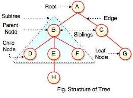
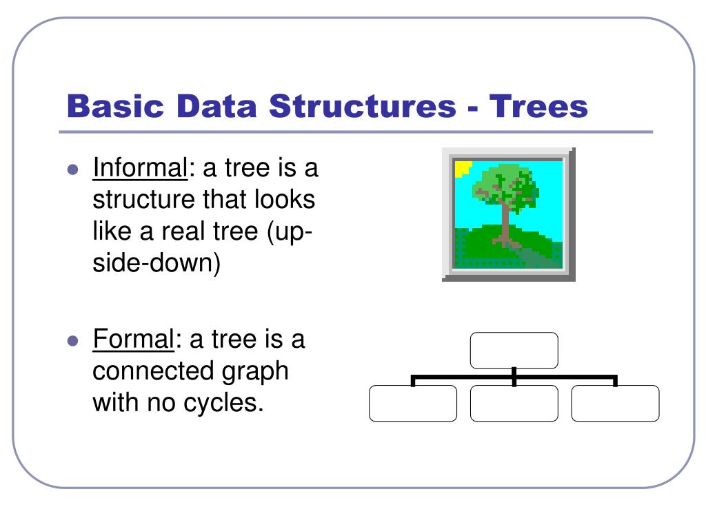

### Trees in Data Structures



Trees are hierarchical data structures composed of nodes connected by edges. Each
node can have zero or more child nodes, forming a branching structure. Trees are
widely used for representing hierarchical relationships, such as file systems,
organization charts, or hierarchical data in databases. The topmost node is called the root, and every node(except the root) is connected by an edge from exactly one other node, known as its parent. Like a family, nodes with the same parent are siblings, and nodes without children are called leaves.

They also play a crucial role in algorithms and data structures, with various types of trees like binary trees, binary search trees, AVL trees, and B-trees optimized for different purposes. Trees offer efficient search, insertion, and deletion operations, making them essential in many
applications requiring organized and structured data.

A node is a basic unit of a tree.
A node contains data and links to other nodes.
Each node in a tree can have zero or more child nodes.

An example of this in python could be written like this

```python
class TreeNode:
    def **init**(self, data):
        self.data = data
        self.children = []
```

A Root is the topmost node in a tree.
There is exactly one root per tree, and it has no parent.

A Leaf is a node with no children.
Leaves are at the bottommost level of a tree

Depth of a node is the number of edges from the root to the node.
It is an indication of the level at which the node sits in the tree.

Height of a node is the number of edges on the longest path from the node to a leaf.
The height of a tree is the height of its root node.

Practical Applications of trees
Trees are widely used in computer Science for various purposes.

Binary Search Tree(BST): Used for efficient searching and sorting
File Systems: Directories and files are organized in a tree structure
Databases: Trees are used in databases to enable quick data retrieval

Here is a simple python code inserting a new node in a Binary Search Tree

```python
class BSTNode:
    def __init__(self, key):
        self.key = key
        self.left = None
        self.right = None

def insert(root, key):
    if root is None:
        return BSTNode(key)
    else:
        if root.key < key:
```

Trees are a fundamental data structure in computer science with a wide range of applications.
Understanding how they work and how to manipulate them is crucial for software development and algoithm design



[Back to Overview](https://github.com/lachisholm/Data_Structure_Discovery/blob/main/Overview.md)
