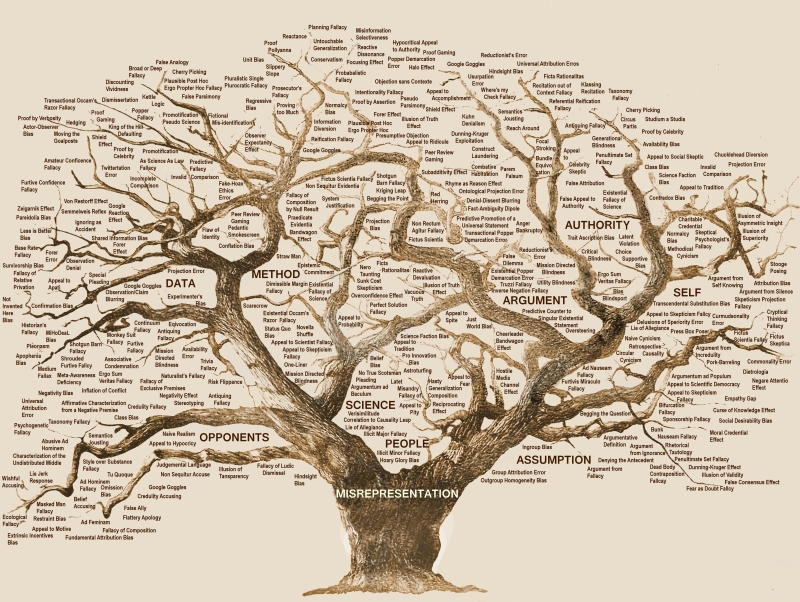

# Trees in Data Structures



Trees are hierarchical data structures composed of nodes connected by edges. Each
node can have zero or more child nodes, forming a branching structure. Trees are
widely used for representing hierarchical relationships, such as file systems,
organization charts, or hierarchical data in databases.

Trees are a fundamental data structure in computer science with a wide range of applications.
Understanding how they work and how to manipulate them is crucial for software development and algoithm design


The topmost node is called the root, and every node(except the root) is connected by an edge from exactly one other node, known as its parent.

Like a family, nodes with the same parent are siblings, and nodes without children are called leaves.


They also play a crucial role in algorithms and data structures, with various types of trees like binary trees, binary search trees, AVL trees, and B-trees optimized for different purposes. Trees offer efficient search, insertion, and deletion operations, making them essential in many
applications requiring organized and structured data.

A node is a basic unit of a tree.
A node contains data and links to other nodes.
Each node in a tree can have zero or more child nodes.

An example of this in python could be written like this

```python
class TreeNode:
    def **init**(self, data):
        self.data = data
        self.children = []
```

- A Root is the topmost node in a tree.
  There is exactly one root per tree, and it has no parent. My code snip below shows a class where each node has a value and a list of children. The root node is then created by intantiating the TreeNode class with the value RootNode

```python

class TreeNode:
    def __init__(self, value):
        self.value = value
        self.children = []

# Here is how you create the root node
root = TreeNode("Root Node")
```

- A Leaf is a node with no children.
  Leaves are at the bottommost level of a tree

```python
class TreeNode:
    def__init__(self, value):
        self.value = value
        self.children = []

# Here is how you create a leaf node_since the leaf has no children
# we don't add any children to the list.
leaf = TreeNode("Leaf Node")
```

- Depth of a node is the number of edges from the root to the node.
  It is an indication of the level at which the node sits in the tree. Meaning it essentially measures how far a node is from the root. So you could also say it's the length of the path from the root to the node. The depth of the root node itself is always zero since there are no edges to traverse to reach it.

  - So let's assume a structure where each node knows its parent, allowing us to directly calculate the depth by counting how many times we can move from the node to its parent until we reach the root.

  - The TreeNode class represents each node with a value and an optional parent

  - The depth function calcualates the depth by traversing up the parent chain until it finds a node without a parent, which would be the root.

  - The depth counter increments with each step up

  - The example constructs a simple tree where 'child2' is a grandchild of the 'root', making its depth 2

```python

class TreeNode:
    def __init__(self, value, parent=None):
        self.value = value
        self.parent = parent

    def depth(node);
    depth = 0
    while node.parent:
        node = node.parent
        depth += 1
    return depth

# This is how to set up a simple tree
root = TreeNode("Root")
# This is the child of the root
child1 = TreeNode("Child 1", root)
# This is the child of the child, which makes it the grandchild of the root
child2 = TreeNode("Child 2", child1)
```

- Height of a node is the number of edges on the longest path from the node to a leaf.
  The height of a tree is the height of its root node.

  - The height of a node to be the number of edges on the longest path from the node to a leaf.
  - A leaf node having no children, has a height of 0.

Here is python code that shows the treenode class represents each node, where a node can have multiple children stored in a list. The add_child method is used to establish parent child relationships. The height function caculates the height of a node.
For a node with no children(a leaf), the height is 0
For other nodes, it recursively finds the height of each child node, selects the maximum height among them, and adds 1(representing the edge between the node and its child)

```python
class TreeNode:
    def __init__(self, value:)
        self.value = value
        self.children = []

    def add-child(self, child):
        self.children.append(child)

def height(node):
    # This is the Base case, if it has no children, it's a leaf
    if not node.children
        return 0

    else:
        # Recursive 1+ the height of the tallest child
        return 1 + max(height(child)for child in node.children)

root = TreeNode("Root")
child1 = TreeNode("Child1")
child2 = TreeNode("Child2")
leaf1 = TreeNode("Leaf 1")
leaf2 = TreeNode("Leaf 2")

root.add_child(child1)
root.add_child(child2)
child1.add_child(leaf1)
child2.add_child(leaf2)

#out puts 2, since the longest path from root to a leaf is 2 edges
print(height(root))

```

- Practical Applications of trees
  Trees are widely used in computer Science for various purposes.

  (under construction !)

- Binary Search Tree(BST): Used for efficient searching and sorting

  (under construction !)

- File Systems: Directories and files are organized in a tree structure

  (under construction !)

- Databases: Trees are used in databases to enable quick data retrieval

  (under construction !)

Here is a simple python code inserting a new node in a Binary Search Tree

```python
class BSTNode:
    def __init__(self, key):
        self.key = key
        self.left = None
        self.right = None

def insert(root, key):
    if root is None:
        return BSTNode(key)
    else:
        if root.key < key:
```

[Back to Overview](https://github.com/lachisholm/Data_Structure_Discovery/blob/main/Overview.md)
